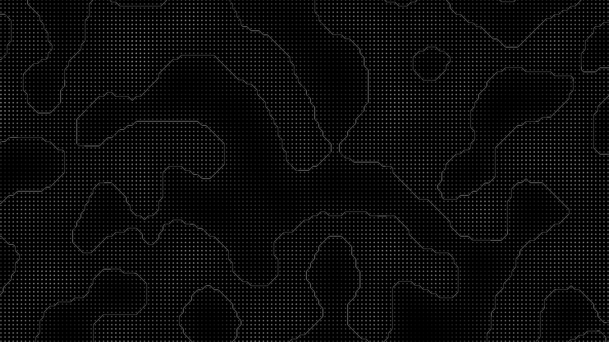

[Wavy](https://github.com/Yocoholo/wavyCPP) - A BGFX marching squares implementation
============================

    <a href="#what-is-it">What is it?</a> -
    <a href="#references">References</a>

What is it?
============================
Wavy is a C++ program that implements a marching squares algorithm for generating waves and makes use of the the [BGFX](https://github.com/bkaradzic/bgfx) graphics library.

Ths was a project to learn how graphics are made. To gain an appreciation for rendering, graphics libraries, and engines. 

References
============================
[BGFX](https://github.com/bkaradzic/bgfx) - The graphics library used in this project.

[BGFX starter template](https://github.com/codetechandtutorials/bgfx_starter_template) - While not entirely used, was useful when starting this project.
